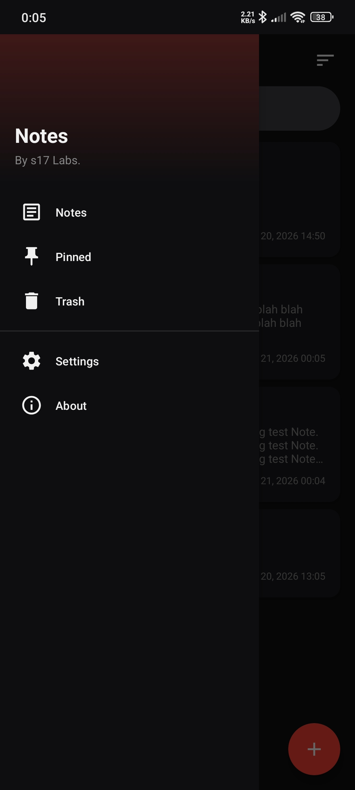

<p align="center">
  
</p>

<h1 align="center">Notes</h1>

---

<p align="center">
  A simple, clean Android notes application with markdown support, pinning, and trash management.
</p>

## Features

- **Create Notes** - Tap the FAB button to create a new note
- **Edit Notes** - Tap on any note to view, then edit it
- **Delete Notes** - Long-press on a note for options, or use the menu in the editor
- **Pin Notes** - Pin important notes to the top
- **Trash** - Deleted notes go to trash, can be restored or permanently deleted
- **Search Notes** - Search through notes by title or content
- **Sort Notes** - Sort by creation or modification date (newest/oldest)
- **Markdown Support** - Format text with bold, italic, underline, and links
- **Auto-Save** - Notes auto-save as you type (can be disabled in settings)
- **Export/Import** - Backup and restore your notes as JSON
- **Dark Theme** - Clean dark UI design

## Screenshots

<p align="center">
  
  
  
</p>
More Screenshots [here](https://github.com/s17labs/notes/tree/main/screenshots)

## Requirements

- Android Studio (Bumblebee or later recommended)
- Android SDK 24 (Android 7.0)
- Gradle 7.x

## Building the Project

1. Clone the repository
2. Open the project in Android Studio
3. Wait for Gradle to sync dependencies
4. Build the project (Build > Make Project)
5. Run on an emulator or physical device

## Updating the App Version

To release a new version:

1. Update `versionName` in `app/build.gradle`:
   ```gradle
   defaultConfig {
       versionName "1.0"  // Change this to your new version
   }
   ```
2. Run the "Build and Release" workflow on GitHub with "release" as the release type
3. The new version will be tagged and added to the Releases page automatically

## Releases

Pre-built APK files are available on the [Releases](https://github.com/s17labs/Notes/releases) page.

## Project Structure

```
Notes/
├── app/
│   ├── src/main/
│   │   ├── java/com/s17labs/notesapp/
│   │   │   ├── MainActivity.java        # Main screen with note list and sidebar
│   │   │   ├── NoteActivity.java        # Note creation/editing
│   │   │   ├── NotePreviewActivity.java # Note preview
│   │   │   ├── NoteAdapter.java         # RecyclerView adapter
│   │   │   ├── NoteDbHelper.java        # SQLite database helper
│   │   │   ├── SettingsActivity.java    # Settings screen
│   │   │   └── AboutActivity.java       # About screen
│   │   ├── res/
│   │   │   ├── layout/                 # XML layouts
│   │   │   ├── drawable/               # Icons and drawables
│   │   │   ├── menu/                   # Navigation and popup menus
│   │   │   └── values/                 # Colors, strings, styles
│   │   └── AndroidManifest.xml
│   └── build.gradle
├── build.gradle
├── settings.gradle
└── gradle/
    └── wrapper/
```

## Tech Stack

- **Language**: Java
- **Min SDK**: 24 (Android 7.0)
- **Target SDK**: 34 (Android 14)
- **UI**: Material Design Components
- **Database**: SQLite
- **Architecture**: MVC

## License

This project is licensed under the MIT License.
