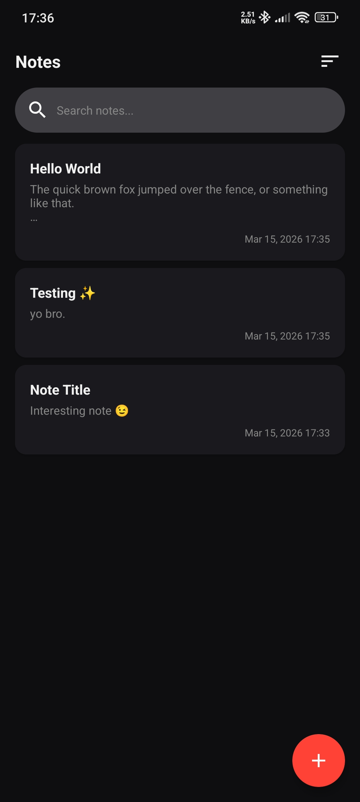
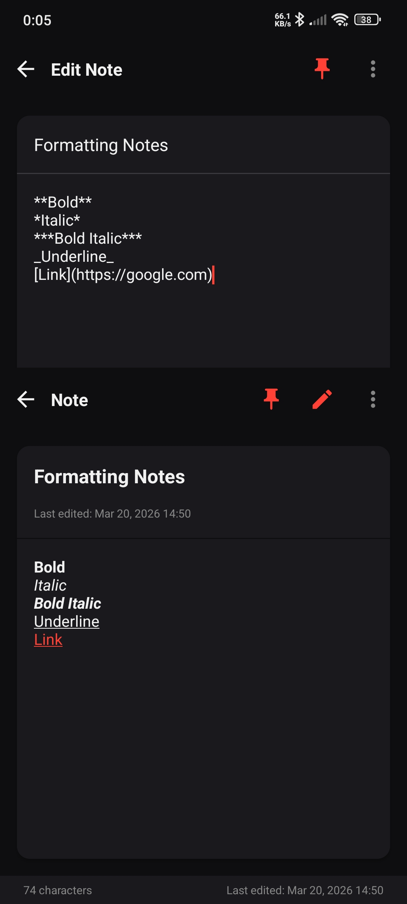

# Notes App

A simple Android notes application built with Java and SQLite for local storage.

## Features

- **Create Notes** - Tap the FAB button to add a new note
- **Edit Notes** - Tap on any note to edit it
- **Delete Notes** - Long-press on a note to delete it
- **Search Notes** - Search through your notes by title or content
- **Sort Notes** - Sort by creation date or modification date (newest/oldest)
- **Persistent Storage** - All notes are stored locally using SQLite

## Screenshots

<p align="center">
  
  
</p>

## Requirements

- Android Studio (Arctic Fox or later recommended)
- Android SDK 30 (Android 11)
- Gradle 7.x

## Building the Project

1. Clone the repository
2. Open the project in Android Studio
3. Wait for Gradle to sync dependencies
4. Build the project (Build > Make Project)
5. Run on an emulator or physical device

## Project Structure

```
Notes/
├── app/
│   ├── src/main/
│   │   ├── java/com/s17labs/notesapp/
│   │   │   ├── MainActivity.java      # Main screen with note list
│   │   │   ├── NoteActivity.java       # Note creation/editing
│   │   │   ├── NoteAdapter.java        # RecyclerView adapter
│   │   │   └── NoteDbHelper.java       # SQLite database helper
│   │   ├── res/
│   │   │   ├── layout/                 # XML layouts
│   │   │   ├── drawable/              # Icons and drawables
│   │   │   └── values/                # Colors, strings, styles
│   │   └── AndroidManifest.xml
│   └── build.gradle
├── build.gradle
├── settings.gradle
└── gradle/
    └── wrapper/
```

## Tech Stack

- **Language**: Java
- **Min SDK**: 24 (Android 7.0)
- **Target SDK**: 30 (Android 11)
- **UI**: Material Design Components
- **Database**: SQLite
- **Architecture**: MVC

## License

This project is licensed under the MIT License.
